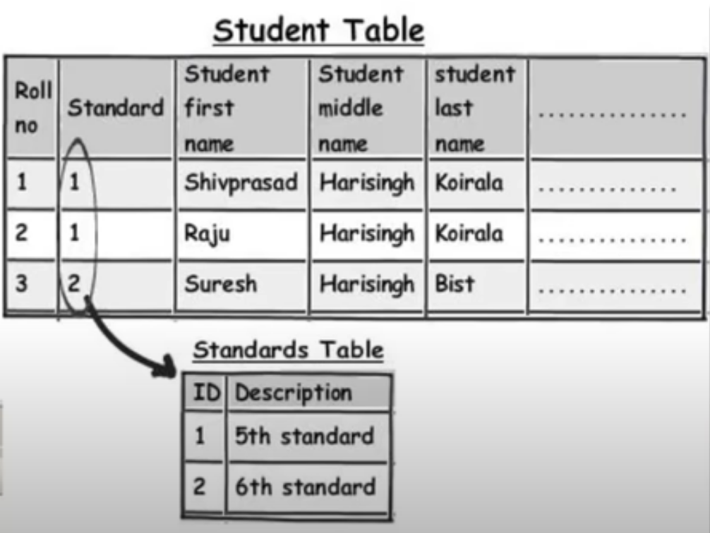

# Database Design Best Practices : Normalization

### Keywords
database design best practices backend normalization rules
normal form
#

## First Normal Form

### Break data into logical components 

<pre>
Name -> FirstName, LastName                 (Right)
Phone -> RegionCode, AreaCode, PhoneNumber  (Wrong)
</pre>

Breaking **phone no.** into components is not useful as its individual components are seldom used that way.

### Avoid Duplicate Data

### Wrong

#
### Right

#
## Second Normal Form
> Convert `(1 to many) -> (1 to 1)`

All columns in a table should **fully** depend on the **primary key** (not **partially**).

Example:
- **Primary Key** is `StandardId & RollNumber`
- **Syllabus** is only dependant on `StandardId` **NOT** `RollNumber`

### Wrong

We have to update every `student` if the syllabus of a `standard` is changed.

#
### Right
- link `StandardId_table` <-> `Syllabus_table` (1 to 1)
- link `Syllabus_table` <-> `Subject_table` (1 to many)

This way we only have to mention `StandardID` to automatically get `syllabus`

If `syllabus` for a `standard` gets updates we only have to mention it once.

#
## Third Normal Form

No columns in a table should depend on other columns.
They can be calculated after data fetching.

